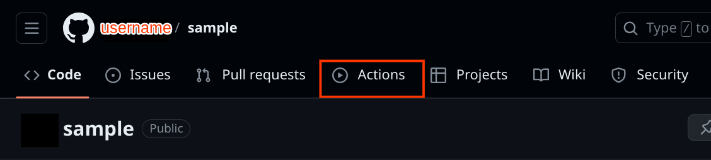
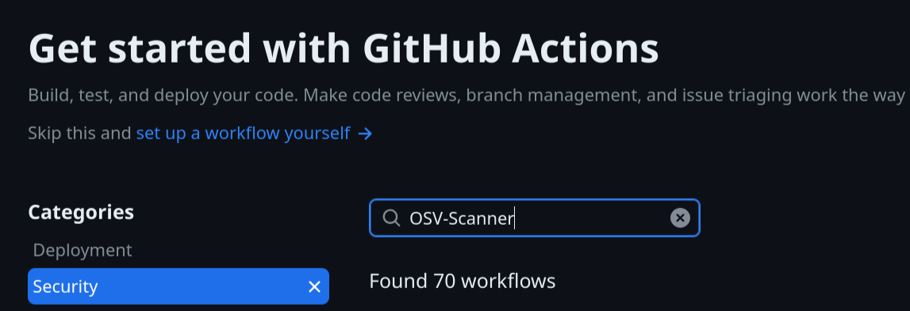
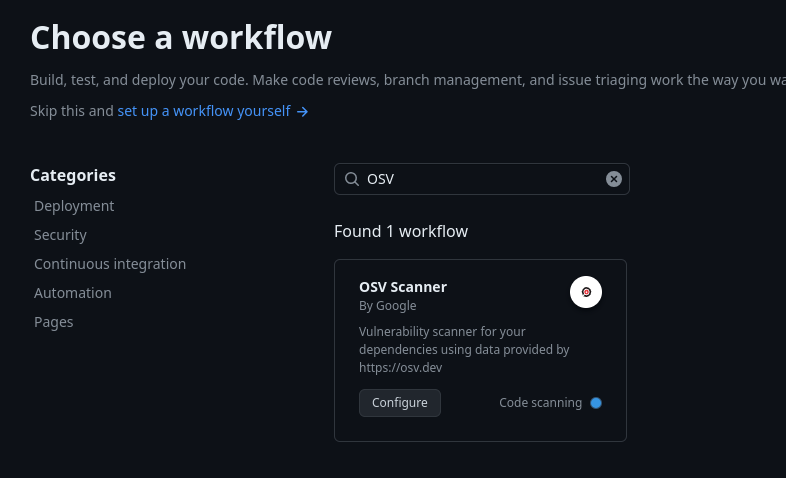

# OSV-Scanner CI/CD Action

<!-- Hard coded release version -->

The OSV-Scanner CI/CD action leverages the [OSV.dev](https://osv.dev/) database and the [OSV-Scanner](https://google.github.io/osv-scanner/) CLI tool to track and notify you of known vulnerabilities in your dependencies for over 11 [languages and ecosystems](https://google.github.io/osv-scanner/supported-languages-and-lockfiles/).

We currently offer two different reusable workflows for Github:

1. A workflow that triggers a scan with each [pull request](https://google.github.io/osv-scanner/github-action/#scan-on-pull-request) and will only report new vulnerabilities introduced through the pull request.
2. A workflow that performs a full vulnerability scan, which can be configured to scan on pushes or a [regular schedule](https://google.github.io/osv-scanner/github-action/#scheduled-scans). The full vulnerability scan can also be configured to run [on release](https://google.github.io/osv-scanner/github-action/#scan-on-release) to prevent releasing with known vulnerabilities in dependencies.

Currently there is no prebuilt workflows for other platforms, but we welcome any contributions for this!

### Scheduled scan
Regularly scanning your project for vulnerabilities can alert you to new vulnerabilities in your dependency tree. The scheduled scan will scan your project on a set schedule or when a new commit is pushed, and report all known vulnerabilities. If vulnerabilities are found it will be reported to the "Code scanning" page.

|                        OSV-Scanner Code Scanning Results                         |                                 Code Scanning Detailed Entry                                  |
| :------------------------------------------------------------------------------: | :-------------------------------------------------------------------------------------------: |
|  |  |

### Scan on pull request
Scanning your project on each pull request can help you keep vulnerabilities out of your project. The pull request scan compares a vulnerability scan of the target branch to a vulnerability scan of the feature branch, and will fail if there are new vulnerabilities introduced through the feature branch. You may choose to [prevent merging](https://docs.github.com/en/repositories/configuring-branches-and-merges-in-your-repository/managing-protected-branches/about-protected-branches#require-status-checks-before-merging) if new vulnerabilities are introduced, but by default the check will only warn users.

|                                                 OSV-Scanner PR Check Failing                                                  |                         PR Scanning Check Output                          |
| :---------------------------------------------------------------------------------------------------------------------------: | :-----------------------------------------------------------------------: |
|  |  |

## Installation

The OSV-Scanner GitHub Action can be [automatically](#automatic-installation) or [manually](#manual-installation) installed.

### Automatic installation

1) From your GitHub project's main page, click “Actions” tab in the navigation bar.

2) (If you already have existing workflows) Select "New Workflow" on the top left.

3) Search for "OSV".

4) Choose the "OSV Scanner" from the list of workflows, and then click “Configure”.

5) Configure the workflow

The automatically installed GitHub Action includes functionality for both a [scheduled scan](#scheduled-scan) and a [scan on pull request](#scan-on-pull-request).

If you only want a scheduled scan, you can comment out the "scan-pr" job and only run the action on "schedule" and on "push".

If you only want to run a scan on pull request, you can comment out the "scan-scheduled" job and only run the action on "pull request" and "merge group".

If you want both, you can leave the action as is. If you want these functionalities to be separate for tracking purposes, we recommend following the [manual installation instructions](#manual-installation).

5) Commit the changes.

### Manual installation

To manually install the CI/CD Action for Github, please follow instructions on our [main documentation page](https://google.github.io/osv-scanner/github-action/).

## Customization

To learn more about optional inputs for the GitHub Action, please see our [main documentation page](https://google.github.io/osv-scanner/github-action/#customization).

## View results

Maintainers can review results of scheduled scans by navigating to their project's `Security > Code Scanning` tab. Vulnerability details can also be viewed by clicking on the details of the failed action.

For pull request scans, results may be viewed by clicking on the details of the failed action, either from your project's actions tab or directly on the PR. Results are also included in GitHub annotations on the "Files changed" tab for the PR.
